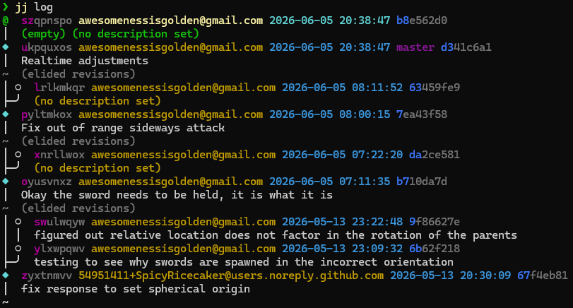

# Plan

## A2 Sword Trail

## C1 Enemy Death Animation

## C4 Blender -> Unreal Grease Pencil

## A5 Sideways Enemy Attack Animation 2

---

# WIP

## A4 Sideways Enemy Attack Animation

- artifacts:
  - https://github.com/SpicyRicecaker/ve-pon/commit/0a033070b4b53f778403f81d1669d9116cb054fc

## A3 Enemy Overhead Attack Animation

- artifacts:
  - https://github.com/SpicyRicecaker/ve-pon/commit/0a033070b4b53f778403f81d1669d9116cb054fc

---

# Done

## C7 Switch to `jj`

- artifacts:
  - 

## C3 Parry System

- artifacts:
  - https://github.com/SpicyRicecaker/ve-pon/commit/0a033070b4b53f778403f81d1669d9116cb054fc

## A1 Spawn Animation

- artifacts: 
  - https://github.com/SpicyRicecaker/ve-pon/commit/b5d66920a43f95d3ffc482bce092ab0d9f8a5a90

- [x] 6 keyframes
- [x] In-betweeners

## C6 Blade Physics

- artifacts:
  - https://github.com/SpicyRicecaker/ve-pon/commit/b79bd0c8d1f93d196bd1ba22fcdca3f15adfd99c
- [x] Respond to physics on player sword overlap

## C5 Planar Regression

- artifacts: 
  - https://github.com/SpicyRicecaker/ve-pon/commit/7fe1d25753a75da019eb6e88cdf3b0a56cc7a6e6
  
- [x] initial prototype
- blockers:
  - regression is inaccurate for high slopes
